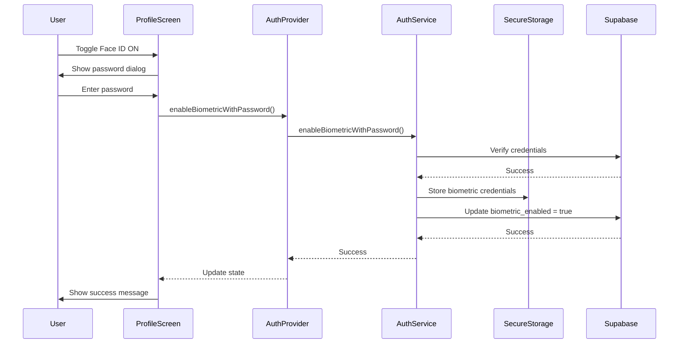
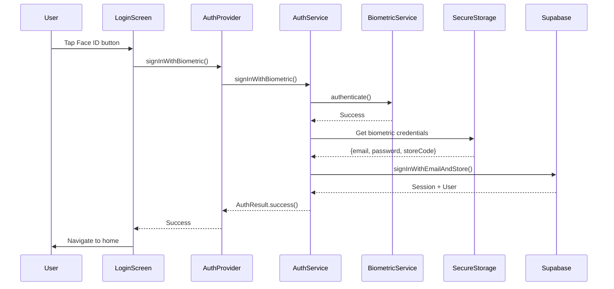
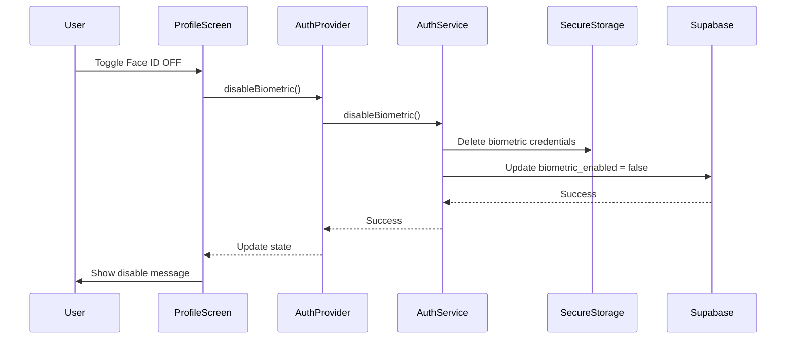

# Biometric Authentication Technical Specification

## Overview
Đặc tả kỹ thuật chi tiết về hệ thống xác thực sinh trắc học (Face ID/Touch ID) trong AgriPOS, bao gồm workflow, architecture, và giải pháp cho các vấn đề phổ biến.

## Table of Contents
1. [Common Implementation Mistakes](#common-implementation-mistakes)
2. [Architecture Overview](#architecture-overview)
3. [Biometric Authentication Flow](#biometric-authentication-flow)
4. [Profile Toggle Persistence](#profile-toggle-persistence)
5. [Remember Email System](#remember-email-system)
6. [Testing & Debugging](#testing--debugging)

---

## Common Implementation Mistakes

### 1. Chưa enable trong Info.plist (iOS)

**Vấn đề:**
Muốn xài Face ID/Touch ID, trong iOS app bắt buộc phải khai báo quyền trong `Info.plist`. Nếu quên, app sẽ crash hoặc Face ID sẽ im ru.

**Giải pháp:**
```xml
<!-- ios/Runner/Info.plist -->
<key>NSFaceIDUsageDescription</key>
<string>App sử dụng Face ID để đăng nhập nhanh và bảo mật</string>
```

### 2. Sai logic request authentication

**Vấn đề:**
Nhiều dev mới quên check biometric available trước khi gọi authenticate. App cứ ném request nhưng device không support → fail ngay từ vòng gửi xe.

**Sai:**
```dart
// Gọi authenticate mà không check available
await BiometricService.authenticate();
```

**Đúng:**
```dart
// Check available trước
final isAvailable = await BiometricService.isAvailable();
if (isAvailable) {
  await BiometricService.authenticate();
}
```

### 3. Quản lý session/token sai

**Vấn đề:**
Lúc đầu code toggle Face ID nhưng lại xóa credential hoặc reset flag sau mỗi lần login/logout. Thành ra dù device có Face ID, app vẫn coi như tắt → user bật hoài vẫn bị OFF.

**Root Cause:**
```dart
// SAI: Xóa biometric credentials khi logout
await signOut() {
  await _supabase.auth.signOut();
  await _secureStorage.clearAll(); // ← XÓA LUÔN BIOMETRIC!
}
```

**Fix:**
```dart
// ĐÚNG: Preserve biometric credentials
await signOut() {
  await _supabase.auth.signOut();
  // Chỉ xóa session, giữ lại biometric credentials
  await _secureStorage.delete('refresh_token');
  // KHÔNG xóa biometric_email, biometric_password, biometric_enabled
}
```

### 4. Chưa link với Keychain (iOS)

**Vấn đề:**
Muốn lưu refresh token/email/password an toàn để Face ID lấy ra, phải cất vào Keychain. Nếu để trong memory hoặc SharedPreferences → logout xong mất sạch.

**Giải pháp:**
Sử dụng `flutter_secure_storage` để tự động map vào Keychain (iOS) và EncryptedSharedPreferences (Android):

```dart
final FlutterSecureStorage _storage = const FlutterSecureStorage();
await _storage.write(key: 'biometric_email', value: email);
```

### 5. Sai môi trường test

**Vấn đề:**
Trên iOS Simulator, Face ID mặc định off, phải bật manual trong Features → Face ID → Enrolled rồi simulate match.

**Fix:**
1. iOS Simulator: Device → Features → Face ID → Enrolled
2. Test trên device thật để đảm bảo accuracy
3. Android Emulator: Settings → Security → Use screen lock → Add fingerprint

### 6. Nhầm lẫn JWT vs Session Token

**Vấn đề:**
Hiểu sai cách hoạt động của Flutter SDK. Supabase trả về token ngắn (12 chars) thay vì JWT (200-300 chars) trong một số trường hợp.

**Explanation:**
- **JWT access token**: Dài ngoằng, base64 encode, 200-300 ký tự
- **Session key/refresh ID**: Token ngắn, 12 ký tự
- **Face ID**: Chỉ unlock flow login cục bộ (local_auth), không tạo JWT
- **Thực tế**: Face ID giúp lấy lại session từ Supabase đã lưu trước đó

**Fix:**
```dart
// Không expect JWT từ biometric login
// Chỉ validate session existence
final session = Supabase.instance.client.auth.currentSession;
if (session != null) {
  // Valid session regardless of token format
}
```

---

## Architecture Overview

### Database Schema

```sql
-- User Profiles Table
CREATE TABLE user_profiles (
  id UUID PRIMARY KEY REFERENCES auth.users(id),
  store_id UUID REFERENCES stores(id),
  full_name TEXT NOT NULL,
  phone TEXT,
  role TEXT NOT NULL DEFAULT 'STAFF',
  biometric_enabled BOOLEAN DEFAULT false, -- ← KEY FIELD
  permissions JSONB DEFAULT '{}',
  is_active BOOLEAN DEFAULT true,
  created_at TIMESTAMP WITH TIME ZONE DEFAULT now(),
  updated_at TIMESTAMP WITH TIME ZONE DEFAULT now()
);
```

### Secure Storage Structure

```dart
// SecureStorageService keys
static const _keyBiometricEmail = 'biometric_email';
static const _keyBiometricPassword = 'biometric_password';
static const _keyBiometricStoreCode = 'biometric_store_code';
static const _keyBiometricEnabled = 'biometric_enabled';
static const _keyRememberEmail = 'remember_email';
static const _keyRememberFlag = 'remember_flag';
```

### Service Layer Architecture

```
┌─────────────────┐    ┌──────────────────┐    ┌─────────────────┐
│   UI Layer      │    │  Provider Layer  │    │ Service Layer   │
│                 │    │                  │    │                 │
│ ProfileScreen   │───▶│ AuthProvider     │───▶│ AuthService     │
│ LoginScreen     │    │                  │    │ BiometricService│
│                 │    │                  │    │ SecureStorage   │
└─────────────────┘    └──────────────────┘    └─────────────────┘
                                │                        │
                                │                        │
                                ▼                        ▼
                       ┌──────────────────┐    ┌─────────────────┐
                       │   Local State    │    │   Persistence   │
                       │                  │    │                 │
                       │ - isAuthenticated│    │ - Keychain/Store│
                       │ - userProfile    │    │ - Supabase DB   │
                       │ - currentStore   │    │                 │
                       └──────────────────┘    └─────────────────┘
```

---

## Biometric Authentication Flow

### 1. Enable Biometric Flow



### 2. Login with Biometric Flow



### 3. Disable Biometric Flow



---

## Profile Toggle Persistence

### Technical Explanation

**Vấn đề ban đầu:**
Toggle Face ID bị reset về OFF sau mỗi lần logout, dù user đã enable.

**Root Cause:**
```dart
// SAI: StatelessWidget với FutureBuilder
Widget _buildBiometricToggle() {
  return FutureBuilder<bool>(
    future: authProvider.isBiometricAvailableAndEnabled(), // ← Chỉ gọi 1 lần
    builder: (context, snapshot) {
      // UI không rebuild khi storage change
    }
  );
}
```

**Giải pháp:**

#### 1. StatefulWidget + State Management
```dart
class _ProfileScreenState extends State<ProfileScreen> {
  bool? _biometricEnabled; // Track state locally

  @override
  void initState() {
    super.initState();
    _loadBiometricState(); // Load from storage on init
  }

  Future<void> _loadBiometricState() async {
    final enabled = await authProvider.isBiometricAvailableAndEnabled();
    if (mounted) {
      setState(() {
        _biometricEnabled = enabled;
      });
    }
  }
}
```

#### 2. Storage Persistence
```dart
// AuthService.disableBiometric() - CRITICAL CHANGE
Future<AuthResult> disableBiometric() async {
  try {
    // Xóa local credentials
    await _secureStorage.deleteBiometricCredentials();

    // Update database
    final user = _supabase.auth.currentUser;
    if (user != null) {
      await _supabase.from('user_profiles')
        .update({'biometric_enabled': false})
        .eq('id', user.id);
    }

    return AuthResult.success();
  } catch (e) {
    return AuthResult.failure(e.toString());
  }
}
```

#### 3. SignOut Preservation
```dart
// AuthService.signOut() - KEY IMPLEMENTATION
Future<void> signOut() async {
  await _supabase.auth.signOut();

  // CRITICAL: Preserve biometric credentials và settings
  // Chỉ clear session-related data
  await _secureStorage.delete('refresh_token');
  await _secureStorage.delete('last_store_code');

  // KEEP: biometric_email, biometric_password, biometric_enabled
  // KEEP: remember_email, remember_flag
}
```

### Why It Works Now

1. **Separate Storage**: Biometric credentials stored independently of session data
2. **StatefulWidget**: UI state managed locally, updates on toggle change
3. **Persistence**: Database `biometric_enabled` field maintains server-side state
4. **Selective Cleanup**: SignOut only clears session, preserves user preferences

---

## Remember Email System

### Architecture

```
┌─────────────────┐    ┌─────────────────────┐    ┌─────────────────┐
│   LoginScreen   │    │   SecureStorage     │    │  User Behavior  │
│                 │    │                     │    │                 │
│ ┌─────────────┐ │    │ remember_flag: bool │    │ 1. Enable toggle│
│ │Remember     │◄├────┤ remember_email: str │◄───┤ 2. Login success│
│ │Email Toggle │ │    │                     │    │ 3. Auto-fill    │
│ └─────────────┘ │    │                     │    │ 4. Persist      │
└─────────────────┘    └─────────────────────┘    └─────────────────┘
```

### Logic Flow

#### 1. Toggle Control (Flag Only)
```dart
// LoginScreen._buildRememberToggle()
onChanged: (value) async {
  final secureStorage = SecureStorageService();

  // ONLY control flag, DO NOT save email here
  await secureStorage.setRememberFlag(value);

  if (!value) {
    // Clear email when user manually disables
    await secureStorage.storeRememberedEmail('');
  }
  // When enabling: DO NOT save email, wait for login success
}
```

#### 2. Email Persistence (Login Success Only)
```dart
// LoginScreen._handleLogin()
if (ok && mounted) {
  final secureStorage = SecureStorageService();
  final rememberFlag = await secureStorage.getRememberFlag();

  if (rememberFlag) {
    // Only save email if remember flag is enabled
    await secureStorage.storeRememberedEmail(_emailController.text.trim());
  }
}
```

#### 3. Auto-fill (App Load)
```dart
// LoginScreen._loadSavedData()
final secureStorage = SecureStorageService();
final rememberFlag = await secureStorage.getRememberFlag();
final email = rememberFlag ? await secureStorage.getRememberedEmail() : null;

if (email != null && email.isNotEmpty) {
  _emailController.text = email;
}
_rememberEmail = rememberFlag; // Set toggle state
```

### Critical Design Decisions

#### Why Toggle Doesn't Save Email Immediately

**Tránh vấn đề:**
- User bật toggle với email sai → email sai được lưu
- User thay đổi email sau khi bật toggle → email cũ vẫn được lưu
- Login screen email field rỗng nhưng toggle ON → lưu empty string

**Solution:**
- Toggle chỉ control flag (`remember_flag`)
- Email chỉ được lưu khi user **actually login success**
- Đảm bảo email saved luôn là email valid và đã verified

#### Why Separate Flag vs Email Storage

```dart
// Hai storage keys độc lập:
remember_flag: bool    // Control toggle state
remember_email: string // Store actual email

// Flow:
1. User enable toggle → remember_flag = true
2. User login success → remember_email = actual_email_used
3. App restart → read remember_flag để show toggle, read remember_email để auto-fill
4. User disable toggle → remember_flag = false, remember_email = ""
```

### Edge Cases Handled

1. **User enable toggle but logout before login**: Flag = true, email = empty → no auto-fill
2. **User login with different email**: New email overwrites old email
3. **User disable toggle**: Both flag and email cleared
4. **App reinstall**: All data lost (expected behavior)
5. **Multiple logout/login cycles**: Email persists correctly

---

## Testing & Debugging

### iOS Simulator Setup
```bash
# Enable Face ID in simulator
Device → Features → Face ID → Enrolled

# Test Face ID match/no match
Device → Features → Face ID → Matching Face / Non-matching Face
```

### Android Emulator Setup
```bash
# Enable fingerprint
Settings → Security → Use screen lock → PIN/Password
Settings → Security → Add fingerprint
```

### Debug Commands
```dart
// Check biometric availability
final isAvailable = await BiometricService.isAvailable();
print('Biometric available: $isAvailable');

// Check stored credentials
final credentials = await SecureStorageService().getBiometricCredentials();
print('Stored credentials: $credentials');

// Check remember flag
final flag = await SecureStorageService().getRememberFlag();
final email = await SecureStorageService().getRememberedEmail();
print('Remember flag: $flag, email: $email');
```

### Common Debug Logs
```dart
// AuthProvider._handleAuthChange()
print('Auth Event: ${event.name}');
print('Session exists: ${session != null}');
print('Token length: ${session?.refreshToken?.length}');

// AuthService.signInWithBiometric()
print('Biometric authentication: $authResult');
print('Credentials loaded: ${credentials.isNotEmpty}');
```

---

## Conclusion

Hệ thống biometric authentication hiện tại đã được thiết kế để:

1. **Persistent**: Toggle và credentials survive logout/restart
2. **Secure**: Sử dụng Keychain/EncryptedSharedPreferences
3. **Robust**: Handle các edge cases và error scenarios
4. **User-friendly**: Clear separation giữa Face ID và Remember Email
5. **Maintainable**: Clean architecture với proper separation of concerns

Key learnings từ bugs đã fix:
- Toggle state != credential storage
- Session cleanup != preference cleanup
- UI state management requires proper StatefulWidget usage
- Biometric flow là local auth + credential retrieval, không phải JWT generation