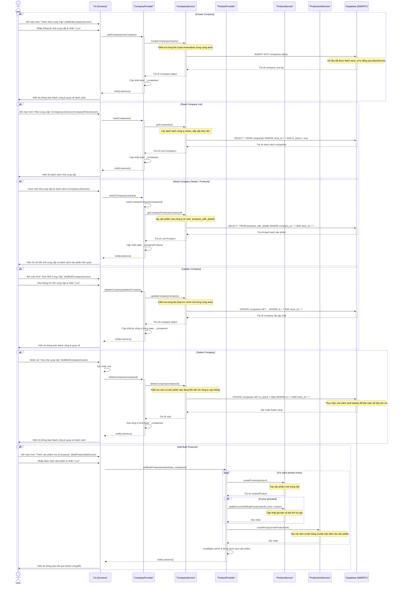

```mermaid
sequenceDiagram
    actor User
    participant UI as "UI (Screens)"
    participant CP as "CompanyProvider"
    participant CS as "CompanyService"
    participant PP as "ProductProvider"
    participant PS as "ProductService"
    participant PUS as "ProductUnitService"
    participant DB as "Supabase (DB/RPC)"

    %% === CREATE COMPANY (THÊM NHÀ CUNG CẤP) ===
    alt Create Company
        User->>+UI: Mở màn hình "Thêm Nhà Cung Cấp" (AddEditCompanyScreen)
        User->>UI: Nhập thông tin nhà cung cấp & nhấn "Lưu"
        UI->>+CP: addCompany(newCompany)
        CP->>+CS: createCompany(company)
        Note over CS: Kiểm tra trùng tên (case-insensitive) trong cùng store.
        CS->>+DB: INSERT INTO companies (data)
        Note over DB: Dữ liệu đã được thêm store_id tự động qua BaseService.
        DB-->>-CS: Trả về company vừa tạo
        CS-->>-CP: Trả về Company object
        CP->>CP: Cập nhật state `_companies`
        CP-->>-UI: notifyListeners()
        UI->>User: Hiển thị thông báo thành công & quay về danh sách
    end

    %% === READ COMPANIES (ĐỌC DANH SÁCH NHÀ CUNG CẤP) ===
    alt Read Company List
        User->>+UI: Mở màn hình "Nhà Cung Cấp" (CompanyListScreen/CompanyPickerScreen)
        UI->>+CP: loadCompanies()
        CP->>+CS: getCompanies()
        Note over CS: Lấy danh sách công ty active, sắp xếp theo tên.
        CS->>+DB: SELECT * FROM companies WHERE store_id = ? AND is_active = true
        DB-->>-CS: Trả về danh sách companies
        CS-->>-CP: Trả về List<Company>
        CP->>CP: Cập nhật state `_companies`
        CP-->>-UI: notifyListeners()
        UI->>User: Hiển thị danh sách nhà cung cấp
    end

    %% === READ COMPANY DETAILS / PRODUCTS BY COMPANY ===
    alt Read Company Details / Products
        User->>+UI: Chọn một nhà cung cấp từ danh sách (CompanyListScreen)
        UI->>+CP: selectCompany(company)
        CP->>+CP: loadCompanyProducts(companyId)
        CP->>+CS: getCompanyProducts(companyId)
        Note over CS: Lấy sản phẩm của công ty từ view `products_with_details`.
        CS->>+DB: SELECT * FROM products_with_details WHERE company_id = ? AND store_id = ?
        DB-->>-CS: Trả về danh sách sản phẩm
        CS-->>-CP: Trả về List<Product>
        CP->>CP: Cập nhật state `_companyProducts`
        CP-->>-UI: notifyListeners()
        UI->>User: Hiển thị chi tiết nhà cung cấp và danh sách sản phẩm liên quan
    end

    %% === UPDATE COMPANY (CẬP NHẬT NHÀ CUNG CẤP) ===
    alt Update Company
        User->>+UI: Mở màn hình "Sửa Nhà Cung Cấp" (AddEditCompanyScreen)
        User->>UI: Sửa thông tin nhà cung cấp & nhấn "Lưu"
        UI->>+CP: updateCompany(updatedCompany)
        CP->>+CS: updateCompany(company)
        Note over CS: Kiểm tra trùng tên (loại trừ chính nó) trong cùng store.
        CS->>+DB: UPDATE companies SET ... WHERE id = ? AND store_id = ?
        DB-->>-CS: Trả về company đã cập nhật
        CS-->>-CP: Trả về Company object
        CP->>CP: Cập nhật lại công ty trong state `_companies`
        CP-->>-UI: notifyListeners()
        UI->>User: Hiển thị thông báo thành công & quay về
    end

    %% === DELETE COMPANY (XÓA NHÀ CUNG CẤP) ===
    alt Delete Company
        User->>+UI: Nhấn nút "Xóa nhà cung cấp" (AddEditCompanyScreen)
        UI->>UI: Xác nhận xóa
        UI->>+CP: deleteCompany(companyId)
        CP->>+CS: deleteCompany(companyId)
        Note over CS: Kiểm tra xem có sản phẩm nào đang liên kết với công ty này không.
        CS->>+DB: UPDATE companies SET is_active = false WHERE id = ? AND store_id = ?
        Note over DB: Thực hiện xóa mềm (soft delete) để bảo toàn dữ liệu lịch sử.
        DB-->>-CS: Xác nhận thành công
        CS-->>-CP: Trả về void
        CP->>CP: Xóa công ty khỏi state `_companies`
        CP-->>-UI: notifyListeners()
        UI->>User: Hiển thị thông báo thành công & quay về danh sách
    end

    %% === ADD BULK PRODUCTS TO COMPANY ===
    alt Add Bulk Products
        User->>+UI: Mở màn hình "Thêm sản phẩm cho [Company]" (BulkProductAddScreen)
        User->>UI: Nhập danh sách sản phẩm & nhấn "Lưu"
        UI->>+PP: addBulkProducts(entriesData, companyId)
        loop For each product entry
            PP->>+PS: createProduct(product)
            Note over PS: Tạo sản phẩm mới trong DB.
            PS-->>-PP: Trả về createdProduct
            alt If price provided
                PP->>+PS: updateCurrentSellingPrice(productId, price, reason)
                Note over PS: Cập nhật giá bán và tạo lịch sử giá.
                PS-->>-PP: Xác nhận
            end
            PP->>+PUS: createProductUnit(ProductUnit)
            Note over PUS: Tạo các đơn vị bán hàng (UoM) mặc định cho sản phẩm.
            PUS-->>-PP: Xác nhận
        end
        PP->>PP: Invalidate cache & tải lại danh sách sản phẩm.
        PP-->>-UI: notifyListeners()
        UI->>User: Hiển thị thông báo kết quả (thành công/lỗi)
    end
```